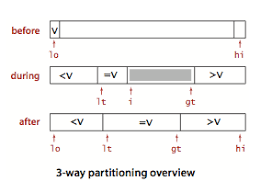

# Notes from week 3 of Coursera Introduction to Algorithms 

<B>Course link</B>: https://www.coursera.org/learn/algorithms-part1/home/week/3

# MergeSort

<B>Top Down Approach</B>: Recursively split the array, sort each half, then merge.

 

 

<B>Bottom Up Approach</B>: Pass through the array, merging subarrays of size 1, 2, 4, 8, 16

 

 

<B>Algorithm Characteristics</B>:
- NlogN time complexity
- Mergesort uses extra space proportional to N (need to build auxilliary arrays)
- It is possible to do this algorithm in place, but not practical so not used

 

<B>Improvements on Mergesort</B>:
- For small arrays, use insertion sort
- Stop if the array is sorted (ie if the biggest element in first half < smallest element in second half)
- Save time by switching the role of input and aux array in each recursive call

# Quicksort

 

<b>Approach</b>: Shuffle the array, then recursively partition the array with one element i such that all elements to the left are less than i and all the elements to the right are greater than i, then repeat for the two subarrays.

 

 

<b>Why is the Shuffle needed?</b>: To ensure that partitioning will produce subarrays that are as balanced as possible, with half of the subarray greater than the partition element, and half less than. The NlogN average time complexity of quicksort relies on this, otherwise the algorithm would have quadratic time complexity.

 

<B>Algorithm Characteristics</B>:
- In place sorting (advantage over mergesort)
- Faster in general than mergesort, because it doesn't move data between two arrays
- NlogN average time complexity (assuming random sort)
- Depth of recursion logarithmic

 

<b>Improvements on Quicksort</b>:
- If the array is small, use insertion sort
- Estimate the partition element to be in the middle, e.g. use the median of 3 random items

 

<b>Quicksort with 3-way partitioning</b>:

If the array has duplicates and all items equal to the partitioning element are put on one side, then time complexity can degrade to 1/2 N 2 

The solution is to partition the array into 3 parts:
- Entries less than the partition element
- Entries greater than the partition element
- Entries equal to the partition element

 

 

# Stability
A <b>stable</b> sort preserves the relative order of items with equal keys.

Stable sorting algorithms:
- Mergesort
- Insertion sort

Unstable sorting algorithms:
- Shellsort
- Quicksort

 

# Extra Resources

## Blogs
- Timsort (sorting algo used by python): https://www.geeksforgeeks.org/timsort/
- Quicksort vs Mergesort: https://www.geeksforgeeks.org/quick-sort-vs-merge-sort/#:~:text=Merge%20sort%20is%20more%20efficient,larger%20array%20size%20or%20datasets.&text=Quick%20sort%20is%20more%20efficient,is%20sorted%20in%20main%20memory.

 

## Videos

- MyCodeSchool Merge Sort: https://www.youtube.com/watch?v=TzeBrDU-JaY&list=PL2_aWCzGMAwKedT2KfDMB9YA5DgASZb3U&index=5&ab_channel=mycodeschool
- MyCodeSchool Quicksort: https://www.youtube.com/watch?v=0nlPxaC2lTw&list=PL2_aWCzGMAwKedT2KfDMB9YA5DgASZb3U&index=6&ab_channel=mycodeschool
- MyCodeSchool Analysis of Mergesort: https://www.youtube.com/watch?v=0nlPxaC2lTw&list=PL2_aWCzGMAwKedT2KfDMB9YA5DgASZb3U&index=7&ab_channel=mycodeschool
- MyCodeSchool Analysis of Quicksort: https://www.youtube.com/watch?v=3Bbm3Prd5Fo&list=PL2_aWCzGMAwKedT2KfDMB9YA5DgASZb3U&index=8&ab_channel=mycodeschool

## Leet Code Exercises
- Easy: https://leetcode.com/problems/merge-sorted-array/submissions/
- Medium: 
- Hard: 