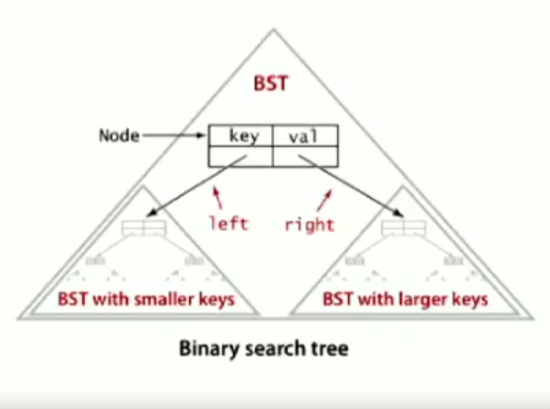

# Notes from week 4 of Coursera Introduction to Algorithms 

<B>Course link</B>: https://www.coursera.org/learn/algorithms-part1/home/week/4

 

## Priority Queues

A Priority Queue is a tree based data structure, its main methods include insert, delMax and isEmpty.

 

<b>Binary Trees: </b> Node with links to left and right binary trees (recursive definition)

<b>Complete Binary Tree:</b> Balanced, exept for bottom level.

The height of a binary tree is floor(logN)

 

 

<b>Heap Ordered Binary Tree:</b>
- Keys in the nodes
- Parents key is greater or equal to children's keys

<b>Array Representation:</b> Order data such that the children of node at array position k are 2k and 2k + 1.

<b>Time Complexity:</b> insert and del max both take log N time

 

### Heapsort: in-place sort
- Create max-heap using all N keys
    - This is acheived using a bottom-up approach, creating 3-node heaps then joining them together until the whole array is sorted.
- Repeatedly remove the max key
    - Exchange the first element of the array with the last, then sink the new top element of the tree till it's in the correct place.

 

<b>Analysis:</b>

In-place and gauranteed NlogN    

Pros:
- Heap construction uses < 2N compares and exchanges
- Heap Sort < 2 NlgN compares and exchanges

Cons:
- Inner loop takes longer than quicksort 
- Not Stable
- Random references to array so hard to optimise with cache

 

## Symbol Tables

 

Basic Operations: 
- Insert a value with key
- Given a key, return the corresponding value

 

Potential Operations on ordered symbol tables:
- min()
- floor()
- select()
- ceiling()

 

### Binary Search Trees

 

A binary search tree is a binary tree in symmetric order, which means that node's keys are larger than all keys in its left subtree and smaller than keys in its right subtree.

 

<b>Implementation:</b> The tree is a reference to the root node, each node in the tree has a key, value reference to left subtree and reference to right subtree.

<b>Operations:</b>
- Insert: If less, go left, if greater, go right, if null, insert
- Search: If less, go left, if greater, go right, if equal, return value

<b>Analysis: </b> If N distinct keys are inserted into a Binary Search Tree in a random order, the expected number of compares for a seach/ insert ~2ln(k)

 

 Deleting elements from binary search trees: </b> (Hibbard deletion)

- 0 Children: Delete t by setting parent to null
- 1 Child: Delete t by replacing parent link
- 2 Childen: Find least element in its right subtree, swap it so that the target now has at most one child, then delete it

 

Downsides of Hibbard Deletion:
- Not symmetric, after many random inserts and deletes, the tree becomes skewed, now sqr(N) not log(N)

## Videos:
- MyCodeSchool: https://www.youtube.com/watch?v=pYT9F8_LFTM&ab_channel=mycodeschool
- MIT OpenCourseWare: https://www.youtube.com/watch?v=9Jry5-82I68&ab_channel=MITOpenCourseWare

## LeetCode:
- Easy: https://leetcode.com/problems/same-tree/
- Medium: https://leetcode.com/problems/kth-largest-element-in-an-array/
- Hard: https://leetcode.com/problems/data-stream-as-disjoint-intervals/

## Extra Resources:
- Python heapq implementation: https://github.com/python/cpython/blob/3.10/Lib/heapq.py
