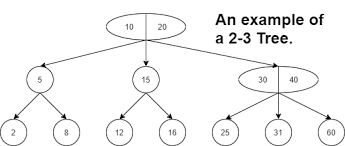
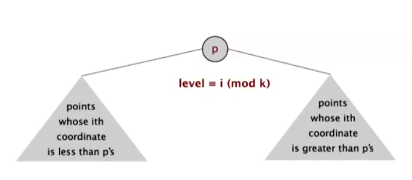
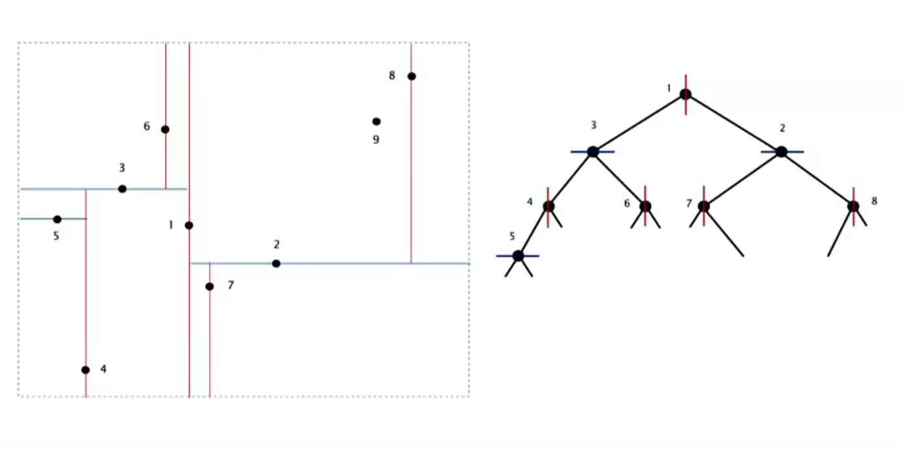

# Notes from week 5 of Coursera Introduction to Algorithms 

<B>Course link</B>: https://www.coursera.org/learn/algorithms-part1/home/week/5

 

<h1>Balanced Search Trees</h1>

 

<b>Goal</b>: find a symbol table that can be guaranteed to have logN time for search, insert and delete, rather than relying on average time, since we don't have control over the order of operations.

 

<b>2-3 Search Trees</b>

 

Allow 1 or 2 keys per node
- 2 node: one key, two children
- 3-node: two keys, three children

 

 

Inserting elements at the bottom:
- Search for the key, if it's a 2-node, insert and convert to a 3-node, if it is a 3-node, insert and convert to a temporary 4-node, before splitting and converting the parent to a 3-node
- The only time that the tree's height increases is if the insert perculates to the top and the root node becomes a temporary 4-node.

Each transformation maintains symmetric order and perfect balance.

Tree height:
- worst case: lgN
- best case: log3N

This means that search, insert and delete all have guaranteed logarithmic time!

<b>red-black Binary Search Trees</b>

1) Represent 2-3 tree as BST
2) Use "internal" left-leaning links as "glue" for 3-nodes

Worst case scenario, search, insert and delete are all 2lgN performance
  

<h1> kd trees </h1>

<b>Challenge </b>: design efficient k-dimensional search

Clustering effects mean that grid implementation often fails

<b> kd trees </b> work by recursively partitioning 1 dimension of the space at a time into a tree data structure

  

2-d trees divide space by alternating between horizontal and vertical axes:

